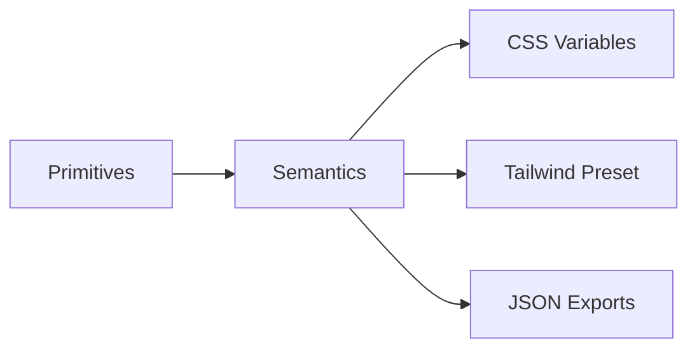

# Design Tokens Reference

> Single source of truth for the Anti‑AI Style System: colors, type, spacing, motion, and semantics for web apps and marketing sites targeting government & enterprise.

**Status:** v1.0 • **Last updated:** 2025‑11‑07

---

## 0) Philosophy & Structure

* **Primitives**: raw brand values (e.g., `color.primary`, `font.family.body`). These rarely change.
* **Semantics**: usage‑oriented tokens (e.g., `surface.card`, `text.muted`, `action.primary.bg`). These adapt across themes (light/dark/high‑contrast) without refactoring components.
* **Outputs**: CSS Variables (runtime theming), Tailwind preset, and JSON (Style Dictionary / design‑ops).



---

## 1) Primitives

### 1.1 Color (Brand Core)

> Muted, confident tones—stability first. Accent sparingly.

```jsonc
{
  "color": {
    "primary": "#1A365D",   // Navy Authority
    "secondary": "#64748B", // Slate Competence
    "accent": "#0D9488",    // Teal Trust
    "neutral": {
      "0": "#FFFFFF",       // Crisp White
      "900": "#334155"      // Dusk Gray
    },
    "status": {
      "success": "#10B981",
      "warning": "#F59E0B",
      "error":   "#DC2626",
      "info":    "#2563EB"
    }
  }
}
```

> **Note**: We intentionally avoid huge auto‑generated scales to keep the system opinionated and human. Derive additional tones via opacity or HSL shifts at the component level when truly needed.

### 1.2 Typography

```jsonc
{
  "font": {
    "family": {
      "heading": "'Playfair Display', ui-serif, Georgia, serif",
      "subheading": "'Merriweather', ui-serif, Georgia, serif",
      "body": "Inter, ui-sans-serif, system-ui, -apple-system, 'Segoe UI', Roboto, 'Helvetica Neue', Arial, 'Noto Sans', 'Apple Color Emoji', 'Segoe UI Emoji'",
      "ui": "Poppins, ui-sans-serif, system-ui, -apple-system, 'Segoe UI', Roboto, 'Helvetica Neue'",
      "mono": "'Montserrat Subrayada', ui-monospace, SFMono-Regular, Menlo, Monaco, Consolas, 'Liberation Mono', 'Courier New', monospace"
    },
    "size": { "xs": 12, "sm": 14, "md": 16, "lg": 18, "xl": 20, "2xl": 24, "3xl": 30, "4xl": 36, "5xl": 48 },
    "lineHeight": { "tight": 1.25, "normal": 1.6, "loose": 1.8 },
    "weight": { "regular": 400, "medium": 500, "semibold": 600, "bold": 700 }
  }
}
```

### 1.3 Spacing, Radius, Shadows, Motion

```jsonc
{
  "space": { "0": 0, "1": 2, "2": 4, "3": 8, "4": 12, "5": 16, "6": 24, "7": 32, "8": 48, "9": 64 },
  "radius": { "none": 0, "sm": 4, "md": 8, "lg": 12, "xl": 16, "pill": 999 },
  "shadow": {
    "sm": "0 1px 2px rgba(0,0,0,0.05)",
    "md": "0 4px 6px rgba(0,0,0,0.06)",
    "lg": "0 10px 16px rgba(0,0,0,0.08)"
  },
  "motion": {
    "duration": { "fast": "100ms", "base": "200ms", "slow": "300ms" },
    "easing": { "in": "cubic-bezier(0.4, 0, 1, 1)", "out": "cubic-bezier(0, 0, 0.2, 1)", "inOut": "cubic-bezier(0.4, 0, 0.2, 1)" }
  },
  "z": { "base": 0, "raised": 10, "popover": 50, "modal": 100, "overlay": 1000 },
  "breakpoint": { "sm": 640, "md": 768, "lg": 1024, "xl": 1280, "2xl": 1536 }
}
```

---

## 2) Semantics (Theme‑Aware)

> These map primitives to intent. Switch theme → update semantics without touching components.

```jsonc
{
  "semantic": {
    "light": {
      "bg": { "canvas": "{color.neutral.0}", "surface": "#F8FAFC", "elevated": "#FFFFFF" },
      "text": { "primary": "#0F172A", "secondary": "#334155", "muted": "#475569", "onAccent": "#FFFFFF" },
      "border": { "subtle": "#E2E8F0", "strong": "#CBD5E1" },
      "action": {
        "primary": { "bg": "{color.accent}", "fg": "{semantic.light.text.onAccent}", "hover": "#0B7F76", "focus": "#0B7F76" },
        "secondary": { "bg": "{color.primary}", "fg": "#FFFFFF", "hover": "#162C4B" }
      },
      "status": {
        "success": { "fg": "{color.status.success}" },
        "warning": { "fg": "{color.status.warning}" },
        "error":   { "fg": "{color.status.error}" },
        "info":    { "fg": "{color.status.info}" }
      },
      "link": { "fg": "{color.accent}", "hover": "#0B7F76" }
    },
    "dark": {
      "bg": { "canvas": "{color.neutral.900}", "surface": "#1E293B", "elevated": "#0B1220" },
      "text": { "primary": "#E2E8F0", "secondary": "#CBD5E1", "muted": "#94A3B8", "onAccent": "#062825" },
      "border": { "subtle": "#334155", "strong": "#475569" },
      "action": {
        "primary": { "bg": "{color.accent}", "fg": "#05211E", "hover": "#0FA197", "focus": "#0FA197" },
        "secondary": { "bg": "{color.primary}", "fg": "#E2E8F0", "hover": "#20416B" }
      },
      "status": {
        "success": { "fg": "{color.status.success}" },
        "warning": { "fg": "{color.status.warning}" },
        "error":   { "fg": "{color.status.error}" },
        "info":    { "fg": "{color.status.info}" }
      },
      "link": { "fg": "#22B8AD", "hover": "#2CD5CA" }
    },
    "highContrast": {
      "bg": { "canvas": "#000000", "surface": "#000000", "elevated": "#0A0A0A" },
      "text": { "primary": "#FFFFFF", "secondary": "#FFFFFF", "muted": "#EDEDED", "onAccent": "#000000" },
      "border": { "subtle": "#FFFFFF", "strong": "#FFFFFF" },
      "action": { "primary": { "bg": "#00FFFF", "fg": "#000000", "hover": "#7FFFFF" } },
      "link": { "fg": "#00FFFF", "hover": "#7FFFFF" }
    }
  }
}
```

---

## 3) CSS Variables (Runtime)

> Drop into your global stylesheet. Toggle `.dark` or `.hc` on `<html>`/`<body>` to switch.

```css
:root {
  /* Primitives */
  --color-primary:  #1A365D;
  --color-secondary:#64748B;
  --color-accent:   #0D9488;
  --color-neutral-0:#FFFFFF;
  --color-neutral-900:#334155;
  --color-success:  #10B981;
  --color-warning:  #F59E0B;
  --color-error:    #DC2626;
  --color-info:     #2563EB;

  --font-heading: 'Playfair Display', ui-serif, Georgia, serif;
  --font-subheading: 'Merriweather', ui-serif, Georgia, serif;
  --font-body: Inter, ui-sans-serif, system-ui, -apple-system, 'Segoe UI', Roboto, 'Helvetica Neue', Arial, 'Noto Sans';
  --font-ui: Poppins, ui-sans-serif, system-ui, -apple-system, 'Segoe UI', Roboto, 'Helvetica Neue';
  --font-mono: 'Montserrat Subrayada', ui-monospace, SFMono-Regular, Menlo, Monaco, Consolas, 'Liberation Mono', 'Courier New', monospace;

  --fs-xs: 12px; --fs-sm: 14px; --fs-md: 16px; --fs-lg: 18px; --fs-xl: 20px; --fs-2xl: 24px; --fs-3xl: 30px; --fs-4xl: 36px; --fs-5xl: 48px;
  --lh-tight: 1.25; --lh-normal: 1.6; --lh-loose: 1.8;

  --space-0: 0px; --space-1: 2px; --space-2: 4px; --space-3: 8px; --space-4: 12px; --space-5: 16px; --space-6: 24px; --space-7: 32px; --space-8: 48px; --space-9: 64px;
  --radius-sm: 4px; --radius-md: 8px; --radius-lg: 12px; --radius-xl: 16px; --radius-pill: 999px;
  --shadow-sm: 0 1px 2px rgba(0,0,0,0.05);
  --shadow-md: 0 4px 6px rgba(0,0,0,0.06);
  --shadow-lg: 0 10px 16px rgba(0,0,0,0.08);

  --dur-fast: 100ms; --dur-base: 200ms; --dur-slow: 300ms;
  --ease-in: cubic-bezier(0.4, 0, 1, 1);
  --ease-out: cubic-bezier(0, 0, 0.2, 1);
  --ease-in-out: cubic-bezier(0.4, 0, 0.2, 1);

  /* Semantics — Light */
  --bg-canvas: var(--color-neutral-0);
  --bg-surface: #F8FAFC;
  --bg-elevated: #FFFFFF;
  --text-primary: #0F172A;
  --text-secondary: #334155;
  --text-muted: #475569;
  --text-on-accent: #FFFFFF;
  --border-subtle: #E2E8F0;
  --border-strong: #CBD5E1;
  --action-primary-bg: var(--color-accent);
  --action-primary-fg: var(--text-on-accent);
  --action-primary-hover: #0B7F76;
  --action-secondary-bg: var(--color-primary);
  --action-secondary-fg: #FFFFFF;
  --link-fg: var(--color-accent);
  --link-hover: #0B7F76;
}

.dark {
  --bg-canvas: var(--color-neutral-900);
  --bg-surface: #1E293B;
  --bg-elevated: #0B1220;
  --text-primary: #E2E8F0;
  --text-secondary: #CBD5E1;
  --text-muted: #94A3B8;
  --text-on-accent: #05211E;
  --border-subtle: #334155;
  --border-strong: #475569;
  --action-primary-bg: var(--color-accent);
  --action-primary-fg: #05211E;
  --action-primary-hover: #0FA197;
  --action-secondary-bg: var(--color-primary);
  --action-secondary-fg: #E2E8F0;
  --link-fg: #22B8AD;
  --link-hover: #2CD5CA;
}

.hc { /* High Contrast override */
  --bg-canvas: #000; --bg-surface: #000; --bg-elevated: #0A0A0A;
  --text-primary: #FFF; --text-secondary: #FFF; --text-muted: #EDEDED; --text-on-accent: #000;
  --border-subtle: #FFF; --border-strong: #FFF;
  --action-primary-bg: #0FF; --action-primary-fg: #000; --action-primary-hover: #7FFFFF;
  --link-fg: #0FF; --link-hover: #7FFFFF;
}
```

**Texture helper (optional):**

```css
.u-texture-linen { background-image: url('/assets/textures/linen.svg'); background-size: 512px 512px; opacity: 0.12; }
```

---

## 4) Tailwind Preset (tokens‑first)

> Consume tokens via CSS variables so runtime theming just works.

`tailwind.preset.js`

```js
/** @type {import('tailwindcss').Config} */
module.exports = {
  theme: {
    extend: {
      colors: {
        bg: {
          canvas: 'var(--bg-canvas)',
          surface: 'var(--bg-surface)',
          elevated: 'var(--bg-elevated)'
        },
        text: {
          primary: 'var(--text-primary)',
          secondary: 'var(--text-secondary)',
          muted: 'var(--text-muted)'
        },
        border: {
          subtle: 'var(--border-subtle)',
          strong: 'var(--border-strong)'
        },
        action: {
          primary: 'var(--action-primary-bg)',
          primaryFg: 'var(--action-primary-fg)',
          secondary: 'var(--action-secondary-bg)',
          secondaryFg: 'var(--action-secondary-fg)'
        },
        link: {
          DEFAULT: 'var(--link-fg)',
          hover: 'var(--link-hover)'
        }
      },
      fontFamily: {
        heading: 'var(--font-heading)',
        subheading: 'var(--font-subheading)',
        body: 'var(--font-body)',
        ui: 'var(--font-ui)',
        mono: 'var(--font-mono)'
      },
      fontSize: {
        xs: 'var(--fs-xs)', sm: 'var(--fs-sm)', md: 'var(--fs-md)', lg: 'var(--fs-lg)', xl: 'var(--fs-xl)',
        '2xl': 'var(--fs-2xl)', '3xl': 'var(--fs-3xl)', '4xl': 'var(--fs-4xl)', '5xl': 'var(--fs-5xl)'
      },
      borderRadius: { sm: 'var(--radius-sm)', md: 'var(--radius-md)', lg: 'var(--radius-lg)', xl: 'var(--radius-xl)', pill: 'var(--radius-pill)' },
      boxShadow: { sm: 'var(--shadow-sm)', md: 'var(--shadow-md)', lg: 'var(--shadow-lg)' },
      transitionDuration: { fast: 'var(--dur-fast)', base: 'var(--dur-base)', slow: 'var(--dur-slow)' },
      transitionTimingFunction: { in: 'var(--ease-in)', out: 'var(--ease-out)', inOut: 'var(--ease-in-out)' },
      zIndex: { base: '0', raised: '10', popover: '50', modal: '100', overlay: '1000' }
    }
  }
}
```

Usage example:

```tsx
export function PrimaryButton({ children }) {
  return (
    <button className="bg-action-primary text-action-primaryFg hover:bg-link-hover rounded-md px-4 py-2 font-ui transition duration-fast ease-in-out shadow-sm focus:outline-none focus:ring-2 focus:ring-offset-2" style={{
      // optional micro‑asymmetry
      transform: 'translateY(-0.5px)'
    }}>
      {children}
    </button>
  );
}
```

---

## 5) JSON Export (Style Dictionary)

> For cross‑tooling (Figma Tokens, Storybook docs, CI validations).

`tokens.json`

```json
{
  "source": ["tokens/**/*.json"],
  "platforms": {
    "css": {
      "transformGroup": "css",
      "buildPath": "dist/css/",
      "files": [{ "destination": "variables.css", "format": "css/variables" }]
    },
    "js": {
      "transformGroup": "js",
      "buildPath": "dist/js/",
      "files": [{ "destination": "tokens.js", "format": "javascript/es6" }]
    }
  }
}
```

> **Tip:** Set up a CI job to diff `dist/css/variables.css` against PRs; reject if semantic tokens are removed or primitives are altered without a design review label.

---

## 6) Figma Variables Map (Guidance)

* **Collection:** `Anti‑AI Style System`
* **Modes:** `Light`, `Dark`, `High Contrast`
* Map **Primitives** to *Shared* variables; map **Semantics** to *Alias* variables.
* Example:

  * `Primitive / Color / Primary` → `#1A365D`
  * `Semantic / Light / Action / Primary / BG` → alias of `Primitive / Color / Accent`

> Keep typography sizes as Number variables (px) and families as String variables for clean handoff to engineers.

---

## 7) Accessibility & Performance Guardrails

* **Contrast**: Maintain ≥ 7:1 for body text, ≥ 4.5:1 for UI labels.
* **Motion**: Respect `prefers-reduced-motion`; disable scale/translate effects accordingly.
* **Images**: Budget < 100 KB per image; set `loading="lazy"` and width/height to prevent CLS.
* **Fonts**: Self‑host variable fonts; preload `body` and `heading` with `font-display: swap`.

---

## 8) Governance

* **Change policy**: Alter **Primitives** only via design council sign‑off; **Semantics** can iterate per release.
* **Versioning**: Semantic‑version tokens. Breaking changes bump major.
* **Audit**: Quarterly token audit to align with the Anti‑AI style guide.

---

## 9) Quick Start

1. Add CSS variables to your global stylesheet.
2. Extend Tailwind with `tailwind.preset.js`.
3. Wrap `<html>` with theme class: `"", "dark", or "hc"`.
4. Use semantic utilities (e.g., `bg-bg-surface`, `text-text-primary`, `border-border-subtle`).
5. Run Lighthouse + Axe after each component PR.

---

## 10) Appendix: Sample Component Snippets

**Card**

```tsx
export function Card({ title, children }) {
  return (
    <section className="bg-bg-elevated text-text-primary rounded-md shadow-sm border border-border-subtle p-6">
      <h3 className="font-heading text-2xl mb-3" style={{ letterSpacing: '0.1px' }}>{title}</h3>
      <div className="text-text-secondary">{children}</div>
    </section>
  );
}
```

**Hero**

```tsx
export function Hero() {
  return (
    <div className="bg-bg-surface relative overflow-hidden">
      <div className="absolute inset-0 u-texture-linen pointer-events-none" />
      <div className="max-w-7xl mx-auto px-6 py-20">
        <h1 className="font-heading text-5xl text-text-primary mb-4">Secure infrastructure, human craft.</h1>
        <p className="font-body text-lg text-text-secondary max-w-prose">We build for trust, clarity, and speed—without the AI gloss.</p>
        <div className="mt-8">
          <a className="bg-action-primary text-action-primaryFg hover:bg-link-hover rounded-md px-6 py-3 font-ui transition duration-base ease-in-out shadow-md" href="#">Request Secure Demo</a>
        </div>
      </div>
    </div>
  );
}
```

---

**End of file.**