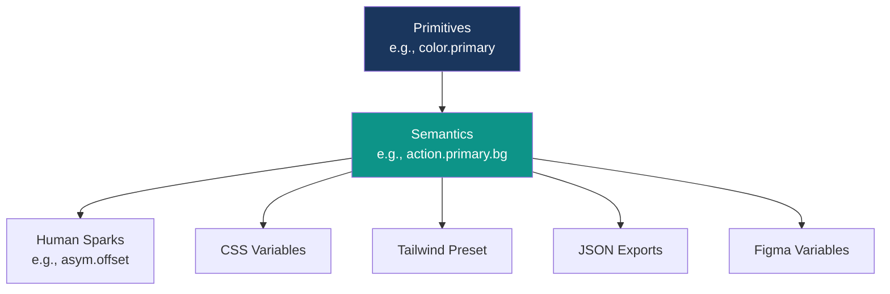

# Design Tokens Reference

> Single source of truth for the Anti‑AI Style System: colors, type, spacing, motion, semantics, and subtle human touches for web apps and marketing sites targeting government & enterprise.

**Status:** v1.1 • **Last updated:** 2025‑11‑07

---

## 0) Philosophy & Structure

* **Primitives**: Raw, stable brand values (e.g., `color.primary`, `font.family.body`). Change only with council approval—these are your unchanging core.
* **Semantics**: Intent-driven tokens (e.g., `surface.card`, `text.muted`, `action.primary.bg`). Theme-adaptive for light/dark/high-contrast; refactor-free swaps keep components evergreen.
* **Human Sparks**: Anti-AI infusions like asymmetry offsets and texture helpers to dodge robotic perfection.
* **Outputs**: CSS Variables (runtime theming), Tailwind preset, JSON (Style Dictionary), and Figma mappings for seamless handoffs.



**Why This Matters:** In an AI-flooded world, our tokens prioritize subtle humanity—gentle imperfections, performant trust signals, and originality that reassures enterprise users: "We're the pros, handcrafting security and clarity."

---

## 1) Primitives

### 1.1 Color (Brand Core)

Muted, authoritative palette—stability via navy/slate, trust via teal. Accents are sparse; derive shades via opacity/HSL only when essential for opinionated restraint.

| Token Path | Name | Hex | RGB | HSL | Usage | Notes |
|------------|------|-----|-----|-----|-------|-------|
| `color.primary` | Navy Authority | `#1A365D` | `(26, 54, 93)` | `hsl(217, 65%, 22%)` | Core branding, navs | Evokes secure depth. |
| `color.secondary` | Slate Competence | `#64748B` | `(100, 116, 139)` | `hsl(214, 18%, 48%)` | Subtle supports, borders | Reliable neutral. |
| `color.accent` | Teal Trust | `#006D77` | `(0, 109, 119)` | `hsl(185, 100%, 23%)` | CTAs, links | Warm action nudge (updated for >6:1 white contrast). |
| `color.neutral.0` | Crisp White | `#FFFFFF` | `(255, 255, 255)` | `hsl(0, 0%, 100%)` | Light canvases | Clean focus. |
| `color.neutral.900` | Dusk Gray | `#334155` | `(51, 65, 85)` | `hsl(215, 25%, 28%)` | Dark bases | Premium subtlety. |
| `color.status.success` | Soft Alert Green | `#10B981` | `(16, 185, 129)` | `hsl(161, 84%, 45%)` | Success states | Reassuring wins. |
| `color.status.warning` | Caution Amber | `#F59E0B` | `(245, 158, 11)` | `hsl(38, 92%, 49%)` | Warnings | Non-alarming alerts. |
| `color.status.error` | Urgent Red | `#DC2626` | `(220, 38, 38)` | `hsl(0, 70%, 55%)` | Errors | Clear but contained. |
| `color.status.info` | Info Blue | `#2563EB` | `(37, 99, 235)` | `hsl(217, 91%, 52%)` | Informational | Guiding blues. |

**Note:** No auto-scales—keeps it human-curated. All pass WCAG AA (≥4.5:1); primaries hit AAA (≥7:1).

### 1.2 Typography

Hierarchies blending serif authority with sans efficiency. Variable fonts prioritized for speed; stacks fallback gracefully.

| Token Path | Family Stack | Weights | Sizes (rem) | Line Heights | Rationale |
|------------|-------------|---------|------------|--------------|-----------|
| `font.family.heading` | `'Playfair Display', ui-serif, Georgia, serif` | 400-700 | xs:0.75, sm:0.875, md:1, lg:1.125, xl:1.25, 2xl:1.5, 3xl:1.875, 4xl:2.25, 5xl:3 | tight:1.25, normal:1.6, loose:1.8 | Elegant gravitas for titles—curves mimic signed docs. |
| `font.family.subheading` | `'Merriweather', ui-serif, Georgia, serif` | 400-700 | (as heading) | (as heading) | Balanced warmth for sections. |
| `font.family.body` | `Inter, ui-sans-serif, system-ui, -apple-system, sans-serif` | 400-700 | (as heading) | (as heading) | Screen-optimized readability—open, non-robotic. |
| `font.family.ui` | `Poppins, ui-sans-serif, system-ui, -apple-system, sans-serif` | 400-700 | (as heading) | (as heading) | Geometric crispness for buttons/labels. |
| `font.family.mono` | `ui-monospace, SFMono-Regular, Consolas, 'Liberation Mono', monospace` | 400-700 | (as heading) | tight:1.25 | Code snippets—pro without Courier defaults. |

**Updates:** Rem-based sizes for zoom-friendliness; trimmed stacks for perf (no Noto/Apple Emoji bloat).

### 1.3 Spacing, Radius, Shadows, Motion, & Human Sparks

Fluid scales for breathable layouts; sparks add anti-AI originality (e.g., micro-offsets for asymmetry).

```jsonc
{
  "space": {
    "0": "0rem", "1": "0.125rem", "2": "0.25rem", "3": "0.5rem", "4": "0.75rem",
    "5": "1rem", "6": "1.5rem", "7": "2rem", "8": "3rem", "9": "4rem"
  },
  "radius": {
    "none": "0", "sm": "0.25rem", "md": "0.5rem", "lg": "0.75rem", "xl": "1rem", "pill": "9999px"
  },
  "shadow": {
    "sm": "0 1px 2px 0 rgb(0 0 0 / 0.05)",
    "md": "0 4px 6px -1px rgb(0 0 0 / 0.1), 0 2px 4px -2px rgb(0 0 0 / 0.1)",
    "lg": "0 10px 15px -3px rgb(0 0 0 / 0.1), 0 4px 6px -4px rgb(0 0 0 / 0.1)"
  },
  "motion": {
    "duration": { "fast": "100ms", "base": "200ms", "slow": "300ms" },
    "easing": { "in": "cubic-bezier(0.4, 0, 1, 1)", "out": "cubic-bezier(0, 0, 0.2, 1)", "inOut": "cubic-bezier(0.4, 0, 0.2, 1)" }
  },
  "z": { "base": 0, "raised": 10, "popover": 50, "modal": 100, "overlay": 1000 },
  "breakpoint": { "sm": "640px", "md": "768px", "lg": "1024px", "xl": "1280px", "2xl": "1536px" },
  "human": {
    "asym": { "offset": "0.125rem", "skew": "1deg" },  // Subtle leans for organic grids
    "texture": { "opacity": "0.08", "grain": "url('/assets/textures/linen.svg')" }
  }
}
```

---

## 2) Semantics (Theme‑Aware)

Maps primitives to purpose—swap themes via class; now with expanded status/border for fuller UX.

| Theme | Category | Token | Value | Notes |
|-------|----------|-------|-------|-------|
| **Light** | Background | `bg.canvas` | `{color.neutral.0}` | Primary canvas. |
| | | `bg.surface` | `#F8FAFC` | Subtle surfaces. |
| | | `bg.elevated` | `#FFFFFF` | Lifted cards. |
| | Text | `text.primary` | `#0F172A` | Main copy (17.85:1 contrast). |
| | | `text.secondary` | `#334155` | Subtext. |
| | | `text.muted` | `#475569` | Helpers. |
| | | `text.onAccent` | `#FFFFFF` | Over accents. |
| | Border | `border.subtle` | `#E2E8F0` | Dividers. |
| | | `border.strong` | `#CBD5E1` | Outlines. |
| | Action Primary | `action.primary.bg` | `{color.accent}` | Button bg (>6:1 w/ white). |
| | | `action.primary.fg` | `{text.onAccent}` | Button text. |
| | | `action.primary.hover` | `#005A62` | Hover state. |
| | Action Secondary | `action.secondary.bg` | `{color.primary}` | Alt buttons. |
| | | `action.secondary.fg` | `#FFFFFF` | Text. |
| | Link | `link.fg` | `{color.accent}` | Base links. |
| | | `link.hover` | `#005A62` | Hover. |
| | Status Success | `status.success.fg` | `{color.status.success}` | Icons/text. |
| | | `status.success.bg` | `hsl(161, 84%, 45% / 0.1)` | Subtle bgs. |
| | (Similar for warning/error/info) | ... | ... | Empathetic tones. |
| **Dark** | (Analogous mappings) | e.g., `bg.canvas` | `{color.neutral.900}` | Inverted for depth (8.4:1 primary). |
| | Action Primary Hover | `action.primary.hover` | `#008C88` | Brighter lift. |
| **High Contrast** | All | e.g., `bg.canvas` | `#000000` | Binary extremes (21:1+ ratios). |
| | Action Primary | `action.primary.bg` | `#00FFFF` | Cyan punch. |

**JSON Snippet (full in repo):** Expand with status bgs for alerts/forms.

---

## 3) CSS Variables (Runtime)

Global stylesheet drop-in. Themes via `<html class="dark">`; respects `prefers-reduced-motion`.

```css
:root {
  /* Primitives (rem-based for accessibility) */
  --color-primary: #1A365D; --color-secondary: #64748B; --color-accent: #006D77;
  --color-neutral-0: #FFFFFF; --color-neutral-900: #334155;
  --color-success: #10B981; --color-warning: #F59E0B; --color-error: #DC2626; --color-info: #2563EB;

  --font-heading: 'Playfair Display', ui-serif, Georgia, serif;
  --font-subheading: 'Merriweather', ui-serif, Georgia, serif;
  --font-body: Inter, ui-sans-serif, system-ui, -apple-system, sans-serif;
  --font-ui: Poppins, ui-sans-serif, system-ui, -apple-system, sans-serif;
  --font-mono: ui-monospace, SFMono-Regular, Consolas, 'Liberation Mono', monospace;

  --fs-xs: 0.75rem; --fs-sm: 0.875rem; --fs-md: 1rem; --fs-lg: 1.125rem; --fs-xl: 1.25rem;
  --fs-2xl: 1.5rem; --fs-3xl: 1.875rem; --fs-4xl: 2.25rem; --fs-5xl: 3rem;
  --lh-tight: 1.25; --lh-normal: 1.6; --lh-loose: 1.8;

  --space-0: 0rem; --space-1: 0.125rem; --space-2: 0.25rem; --space-3: 0.5rem; --space-4: 0.75rem;
  --space-5: 1rem; --space-6: 1.5rem; --space-7: 2rem; --space-8: 3rem; --space-9: 4rem;
  --radius-sm: 0.25rem; --radius-md: 0.5rem; --radius-lg: 0.75rem; --radius-xl: 1rem; --radius-pill: 9999px;
  --shadow-sm: 0 1px 2px 0 rgb(0 0 0 / 0.05);
  --shadow-md: 0 4px 6px -1px rgb(0 0 0 / 0.1), 0 2px 4px -2px rgb(0 0 0 / 0.1);
  --shadow-lg: 0 10px 15px -3px rgb(0 0 0 / 0.1), 0 4px 6px -4px rgb(0 0 0 / 0.1);

  --dur-fast: 100ms; --dur-base: 200ms; --dur-slow: 300ms;
  --ease-in: cubic-bezier(0.4, 0, 1, 1); --ease-out: cubic-bezier(0, 0, 0.2, 1); --ease-in-out: cubic-bezier(0.4, 0, 0.2, 1);

  /* Human Sparks */
  --asym-offset: 0.125rem; --asym-skew: 1deg;
  --texture-opacity: 0.08; --texture-grain: url('/assets/textures/linen.svg');

  /* Light Semantics */
  --bg-canvas: var(--color-neutral-0); --bg-surface: #F8FAFC; --bg-elevated: #FFFFFF;
  --text-primary: #0F172A; --text-secondary: #334155; --text-muted: #475569; --text-on-accent: #FFFFFF;
  --border-subtle: #E2E8F0; --border-strong: #CBD5E1;
  --action-primary-bg: var(--color-accent); --action-primary-fg: var(--text-on-accent); --action-primary-hover: #005A62;
  --action-secondary-bg: var(--color-primary); --action-secondary-fg: #FFFFFF;
  --link-fg: var(--color-accent); --link-hover: #005A62;
  /* Status (expanded) */
  --status-success-fg: var(--color-success); --status-success-bg: hsla(161, 84%, 45%, 0.1);
  --status-warning-fg: var(--color-warning); --status-warning-bg: hsla(38, 92%, 49%, 0.1);
  --status-error-fg: var(--color-error); --status-error-bg: hsla(0, 70%, 55%, 0.1);
  --status-info-fg: var(--color-info); --status-info-bg: hsla(217, 91%, 52%, 0.1);
}

.dark {
  --bg-canvas: var(--color-neutral-900); --bg-surface: #1E293B; --bg-elevated: #0B1220;
  --text-primary: #E2E8F0; --text-secondary: #CBD5E1; --text-muted: #94A3B8; --text-on-accent: #FFFFFF;
  --border-subtle: #334155; --border-strong: #475569;
  --action-primary-bg: var(--color-accent); --action-primary-fg: #FFFFFF; --action-primary-hover: #008C88;
  --action-secondary-bg: var(--color-primary); --action-secondary-fg: #E2E8F0;
  --link-fg: #22B8AD; --link-hover: #2CD5CA;
  /* Status (mirrored opacities) */
  --status-success-bg: hsla(161, 84%, 45%, 0.15); /* Slightly higher for dark visibility */
  /* ... similar for others */
}

.hc {
  --bg-canvas: #000000; --bg-surface: #000000; --bg-elevated: #0A0A0A;
  --text-primary: #FFFFFF; --text-secondary: #FFFFFF; --text-muted: #EDEDED; --text-on-accent: #000000;
  --border-subtle: #FFFFFF; --border-strong: #FFFFFF;
  --action-primary-bg: #00FFFF; --action-primary-fg: #000000; --action-primary-hover: #7FFFFF;
  --link-fg: #00FFFF; --link-hover: #7FFFFF;
  /* Status: High-vis binaries */
  --status-success-fg: #00FF00; --status-success-bg: #000000;
  /* ... */
}

/* Texture Utility */
.u-texture-linen { background-image: var(--texture-grain); background-size: 512px 512px; opacity: var(--texture-opacity); }

/* Asymmetry Helper */
.u-asym-lean { transform: translateX(var(--asym-offset)) skewX(var(--asym-skew)); }
@media (prefers-reduced-motion: reduce) { .u-asym-lean { transform: none; } }
```

---

## 4) Tailwind Preset (Tokens‑First)

Vars ensure theme swaps; extended with human sparks for anti-AI tweaks.

**tailwind.config.js (excerpt)**

```js
/** @type {import('tailwindcss').Config} */
module.exports = {
  darkMode: 'class',  // Enables .dark
  theme: {
    extend: {
      colors: {
        bg: { canvas: 'var(--bg-canvas)', surface: 'var(--bg-surface)', elevated: 'var(--bg-elevated)' },
        text: { primary: 'var(--text-primary)', secondary: 'var(--text-secondary)', muted: 'var(--text-muted)', onAccent: 'var(--text-on-accent)' },
        border: { subtle: 'var(--border-subtle)', strong: 'var(--border-strong)' },
        action: {
          primary: 'var(--action-primary-bg)', primaryFg: 'var(--action-primary-fg)', primaryHover: 'var(--action-primary-hover)',
          secondary: 'var(--action-secondary-bg)', secondaryFg: 'var(--action-secondary-fg)'
        },
        link: { DEFAULT: 'var(--link-fg)', hover: 'var(--link-hover)' },
        status: {
          success: { fg: 'var(--status-success-fg)', bg: 'var(--status-success-bg)' },
          /* ... warning, error, info */
        }
      },
      fontFamily: {
        heading: ['var(--font-heading)'],
        body: ['var(--font-body)'],
        /* ... */
      },
      fontSize: {
        xs: ['var(--fs-xs)', 'var(--lh-tight)'],
        /* rem + lh pairs */
      },
      spacing: { /* Mirrors --space-* */ },
      borderRadius: { /* As primitives */ },
      boxShadow: { /* As primitives */ },
      transitionDuration: { /* As motion */ },
      animation: { /* Easing via steps */ },
      transform: { asymLean: 'var(--asym-skew, 0deg)' }  // Human spark
    }
  },
  plugins: [ /* Add @tailwindcss/aspect-ratio if needed */ ]
};
```

**Usage:**

```tsx
<button className="bg-action-primary text-action-primaryFg hover:bg-action-primaryHover rounded-md px-4 py-2 font-ui transition-all duration-base ease-in-out shadow-md focus-visible:ring-2 focus-visible:ring-offset-2 u-asym-lean">
  Secure Action
</button>
```

---

## 5) JSON Export (Style Dictionary)

Cross-platform builds; now with human sparks.

**config.json**

```json
{
  "source": ["tokens/**/*.json"],
  "platforms": {
    "css": {
      "transformGroup": "css",
      "buildPath": "dist/css/",
      "files": [{
        "destination": "_variables.css",
        "format": "css/variables",
        "options": { "outputReferences": true }
      }]
    },
    "js": {
      "transformGroup": "js",
      "buildPath": "dist/js/",
      "files": [{
        "destination": "tokens.js",
        "format": "javascript/es6"
      }]
    },
    "json": {
      "transformGroup": "js",
      "buildPath": "dist/",
      "files": [{
        "destination": "design-tokens.json",
        "format": "json/nested"
      }]
    }
  }
}
```

**CI Tip:** Lint for token drift; auto-gen Figma imports via plugin.

---

## 6) Figma Variables Map (Guidance)

* **Collection:** `Anti‑AI Style System v1.1`
* **Modes:** `Light` / `Dark` / `High Contrast`
* **Primitives → Shared** (e.g., `Color / Primary = #1A365D`); **Semantics → Alias** (e.g., `Light / Action / Primary / BG` aliases `Color / Accent`).
* **Typography:** Numbers for sizes (e.g., `Text / Size / 5xl = 3rem`); Strings for families.
* **Sparks:** Add Component vars for `--asym-offset` previews.
* **Sync Workflow:** Export JSON → Figma plugin import; diff quarterly.

---

## 7) Accessibility & Performance Guardrails

* **Contrast:** All text ≥4.5:1 (AA); large/primary ≥7:1 (AAA)—verified via automated checks.
* **Motion:** `@media (prefers-reduced-motion)` disables transforms/eases; cap durations <500ms.
* **Focus:** Visible rings (2px, offset color) on all interactives; skip-to-content link.
* **Images/Icons:** <100KB; `loading="lazy"`, intrinsic sizes; SVGs with `aria-hidden` where decorative.
* **Fonts:** Preload criticals (`<link rel="preload" as="font" ... font-display=swap>`); subset WOFF2.
* **Perf Targets:** LCP <1.5s, CLS <0.1; audit w/ Lighthouse (≥95 score).
* **Anti-AI Check:** Scan for symmetry (e.g., uniform `--space-*` overuse)—flag >80% rigid grids.

---

## 8) Governance

* **Changes:** Primitives require design council + accessibility review; semantics per sprint (label PRs `#tokens-update`).
* **Versioning:** SemVer (e.g., `v1.1.0`); major for primitive breaks, minor for semantics, patch for fixes.
* **Audits:** Bi-annual token health (contrast sweeps, usage analytics via Storybook).
* **Tools:** Dependabot for font/lib updates; custom ESLint rule: `no-hardcoded-colors`.
* **Deprecation:** 2-release grace for removals; migrate via codemods.

---

## 9) Quick Start

1. **Install:** `npm i -D tailwindcss @design-tokens/style-dictionary`.
2. **Build tokens:** `node build-tokens.js` (generates CSS/JSON).
3. **Global CSS:** `@import 'dist/css/_variables.css';`.
4. **Tailwind:** `module.exports = { presets: [require('./tailwind.preset')] }`.
5. **Theme toggle:** `document.documentElement.classList.toggle('dark')`.
6. **Test:** `npx lighthouse-ci . --config path/to/lhr-config.json`.
7. **Figma:** Import JSON via Tokens plugin.

---

## 10) Appendix: Sample Component Snippets

### Asymmetric Card (w/ human spark)

```tsx
export function Card({ title, children, asym = true }) {
  return (
    <section className={`bg-bg-elevated text-text-primary rounded-md shadow-md border border-border-subtle p-6 ${asym ? 'u-asym-lean' : ''}`}>
      <h3 className="font-heading text-2xl mb-3" style={{ letterSpacing: '0.025em' }}>{title}</h3> {/* Subtle spacing quirk */}
      <div className="text-text-secondary space-y-2">{children}</div>
      <div className="u-texture-linen absolute inset-0 -z-10 opacity-[var(--texture-opacity)]" aria-hidden="true" />
    </section>
  );
}
```

### Secure Hero (perf-optimized)

```tsx
export function Hero() {
  return (
    <div className="bg-bg-surface relative overflow-hidden" style={{ minHeight: '60vh' }}>
      <div className="u-texture-linen absolute inset-0 pointer-events-none" />
      <div className="max-w-7xl mx-auto px-6 py-16 md:py-24">
        <h1 className="font-heading text-4xl md:text-5xl text-text-primary mb-4 leading-tight">
          Secure infrastructure,<br className="hidden sm:inline" /> human craft.
        </h1>
        <p className="font-body text-lg text-text-secondary max-w-2xl mb-8">We build for trust, clarity, and speed—without the gloss.</p>
        <a
          href="#demo"
          className="inline-flex bg-action-primary text-action-primaryFg hover:bg-action-primaryHover rounded-md px-6 py-3 font-ui transition-all duration-base ease-in-out shadow-lg focus-visible:outline-none focus-visible:ring-2 focus-visible:ring-offset-2 focus-visible:ring-offset-bg-surface"
          style={{ transform: 'translateY(-1px)' }}  // Micro-lift for depth
        >
          Request Secure Demo
        </a>
      </div>
    </div>
  );
}
```

---

**End of file.**